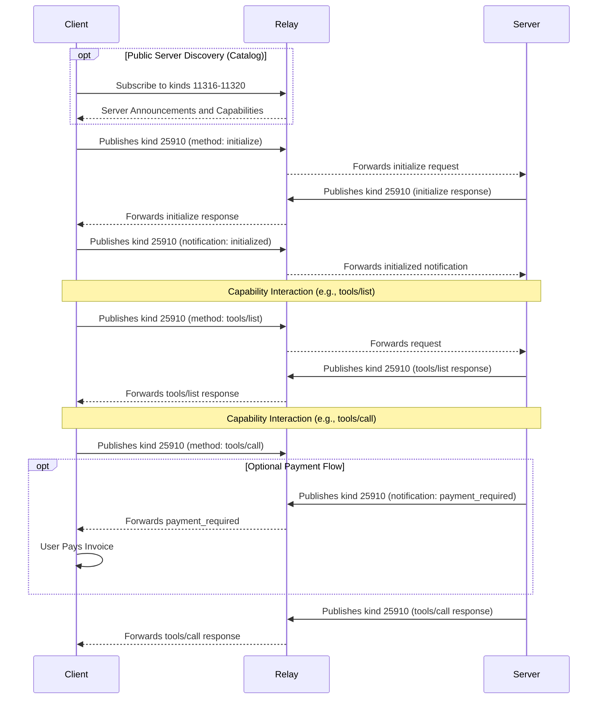

# ContextVM Protocol Specification

**MCP Version:** `mcp:2025-03-26`
**Status:** Draft

## Abstract

The Context Vending Machine (ContextVM) specification defines how Nostr and Context Vending Machines can be used to expose Model Context Protocol (MCP) server capabilities, enabling standardized usage of these resources through a decentralized, cryptographically secure messaging system.

## Table of Contents

- [Introduction](#introduction)
  - [Public Key Cryptography](#public-key-cryptography)
- [Protocol Overview](#protocol-overview)
  - [Main Actors](#main-actors)
- [Event Kinds](#event-kinds)
- [Server Discovery](#server-discovery)
  - [Discovery via Server Announcements (Public Servers)](#discovery-via-server-announcements-public-servers)
    - [Server Announcement Event](#server-announcement-event)
    - [Tools List Event](#tools-list-event)
    - [Resources List Event](#resources-list-event)
    - [Prompts List Event](#prompts-list-event)
  - [Capability Pricing](#capability-pricing)
    - [Pricing Tag Format](#pricing-tag-format)
    - [Example](#example)
    - [Payment Handling](#payment-handling)
  - [Direct Discovery (Private Servers)](#direct-discovery-private-servers)
    - [Client Initialization Request](#client-initialization-request)
    - [Server Initialization Response](#server-initialization-response)
    - [Client Initialized Notification](#client-initialized-notification)
- [Capability Operations](#capability-operations)
  - [List Operations](#list-operations)
    - [List Request Template](#list-request-template)
    - [List Response Template](#list-response-template)
  - [Capability-Specific Item Examples](#capability-specific-item-examples)
    - [Call Tool Request](#call-tool-request)
    - [Call Tool Response](#call-tool-response)
- [Encryption](#encryption)
  - [Overview](#overview-1)
  - [Encryption Support Discovery](#encryption-support-discovery)
  - [Message Encryption Flow](#message-encryption-flow)
    - [1. Content Preparation](#1-content-preparation)
    - [2. Seal Creation (NIP-17)](#2-seal-creation-nip-17)
    - [3. Gift Wrapping (NIP-59)](#3-gift-wrapping-nip-59)
  - [Encrypted Event Structure](#encrypted-event-structure)
    - [Original ContextVM Request](#original-ContextVM-request)
    - [Encrypted ContextVM Request](#encrypted-ContextVM-request)
    - [Encrypted Response Structure](#encrypted-response-structure)
- [Notifications](#notifications)
  - [Notification Template](#notification-template)
  - [Payment Required Notification](#payment-required-notification)
- [Error Handling](#error-handling)
  - [Error Types](#error-types)
  - [Error Response Template](#error-response-template)
- [Implementation Requirements](#implementation-requirements)
- [Complete Protocol Flow](#complete-protocol-flow)
- [Subscription Management](#subscription-management)

## Introduction

The [Model Context Protocol](https://modelcontextprotocol.io/introduction) provides a protocol specification to create servers exposing capabilities and clients consuming them. Meanwhile, the Nostr network and Context Vending Machines offer a decentralized way to announce and consume computational services. This specification defines how to bridge these protocols, allowing MCP servers to advertise and provide their services through the Nostr network.

This specification aims to:

1. Enable discovery of MCP servers and their capabilities through the Nostr network
2. Provide a consistent experience for clients accessing capabilities, and servers exposing their capabilities
3. Maintain compatibility with both protocols while preserving their security models

By integrating these protocols, ContextVM combines the standardized capability framework of MCP with the decentralized, cryptographically secure messaging of Nostr. This integration enables several key advantages:

- **Discoverability**: MCP servers can be discovered through the Nostr network without centralized registries
- **Verifiability**: All messages are cryptographically signed using Nostr's public keys
- **Decentralization**: No single point of failure for service discovery or communication
- **Protocol Interoperability**: Both MCP and ContextVMs utilize JSON-RPC patterns, enabling seamless communication between the protocols

The integration preserves the security model of both protocols while enabling new patterns of interaction.

### Public Key Cryptography

ContextVM leverages Nostr's public key cryptography to ensure message authenticity and integrity:

1. **Message Verification**: Every message is cryptographically signed by the sender's private key and can be verified using their public key, ensuring that:
   - Server announcements come from legitimate providers
   - Client requests are from authorized users
   - Responses are from the expected servers

2. **Identity Management**: Public keys serve as persistent identifiers for all actors in the system:
   - Providers can maintain consistent identities across relays
   - Clients can be uniquely identified for authorization purposes

The cryptographic properties enable secure authorization flows for paid services and private capabilities without requiring centralized authentication services.

## Protocol Overview

### Message Structure

The protocol uses these key design principles for message handling:

1. **Content Field Structure**: The `content` field of Nostr events contains stringified MCP messages. All MCP message structures, are preserved exactly as defined in the MCP specification

2. **Nostr Metadata in Tags**: All Nostr-specific metadata uses event tags:
   - `p`: Public key for addressing providers or clients
   - `e`: Event id, references for correlating requests and responses
   - `cap`: Capability tag for tools, resources, and prompts to provide pricing metadata

3. **Unified Event Kind**: ContextVM uses a single event kind for all communication with specific storage characteristics:
   - `25910`: All ContextVM messages (ephemeral events)
   - `11316`-`11320`: Server announcements and capability listings (replaceable events)
   - `1059`: Encrypted Messages (NIP-59 Gift Wrap)

   These event kinds follow Nostr's conventions in [NIP-01](https://github.com/nostr-protocol/nips/blob/master/01.md#kinds):
   - For kind n such that 20000 <= n < 30000, events are ephemeral, which means they are not expected to be stored by relays for a long period, but rather just transmitted.
   - For kind n such that 10000 <= n < 20000, events are addressable by their kind, pubkey and d tag value -- which means that, for each combination of kind, and pubkey, only the latest event MUST be stored by relays, older versions MAY be discarded.

### Main Actors

There are three main actors in this workflow:

- **Servers**: MCP servers exposing capabilities, operated by a provider using a public key
- **Relays**: Core part of Nostr protocol that allows communication between clients and servers
- **Clients**: MCP or Nostr clients that discover and consume capabilities from servers

## Event Kinds

This specification defines these event kinds:

| Kind  | Description                           |
| ----- | ------------------------------------- |
| 25910 | ContextVM Messages                    |
| 1059  | Encrypted Messages (NIP-59 Gift Wrap) |
| 11316 | Server Announcement                   |
| 11317 | Tools List                            |
| 11318 | Resources List                        |
| 11319 | Resource Templates List               |
| 11320 | Prompts List                          |

**Note on Encryption**: When encryption is enabled, kind 25910 events are wrapped using [NIP-59](https://github.com/nostr-protocol/nips/blob/master/59.md) and published as kind 1059 events. Addressable events (kinds 11316-11320) remain unencrypted for discoverability.

## Server Discovery

ContextVM provides two methods of server discovery, the main differences between these two methods being the visibility of the servers and the way they are advertised. Public servers can advertise themselves and their capabilities to improve discoverability. Private servers may not advertise themselves and their capabilities, but they can be discovered by clients that know the provider's public key.

### Discovery via Server Announcements (Public Servers)

Public server announcements act as a service catalog, allowing clients to discover servers and their capabilities through replaceable events on the Nostr network. This mechanism provides an initial overview of what a server offers, and their public keys to connect with them.

Since each server is uniquely identified by its public key, the announcement events are replaceable (kinds 11316-11320), ensuring that only the most recent version of the server's information is active.

Providers announce their servers and capabilities by publishing events with kinds 11316 (server), 11317 (tools/list), 11318 (resources/list), 11319 (resource templates/list), and 11320 (prompts/list).

**Note:** The `content` field of ContextVM events contains stringified MCP messages. The examples below present the `content` as a JSON object for readability; it must be stringified before inclusion in a Nostr event.

#### Server Announcement Event

```json
{
  "kind": 11316,
  "pubkey": "<provider-pubkey>",
  "content": {
    "protocolVersion": "2025-07-02",
    "capabilities": {
      "prompts": {
        "listChanged": true
      },
      "resources": {
        "subscribe": true,
        "listChanged": true
      },
      "tools": {
        "listChanged": true
      }
    },
    "serverInfo": {
      "name": "ExampleServer",
      "version": "1.0.0"
    },
    "instructions": "Optional instructions for the client"
  },
  "tags": [
    ["name", "Example Server"], // Optional: Human-readable server name
    ["about", "Server description"], // Optional: Server description
    ["picture", "https://example.com/server.png"], // Optional: Server icon/avatar URL
    ["website", "https://example.com"], // Optional: Server website
    ["support_encryption"] // Optional: Presence indicates server supports encrypted messages
  ]
}
```

#### Tools List Event

```json
{
  "kind": 11317,
  "pubkey": "<provider-pubkey>",
  "content": {
    "tools": [
      {
        "name": "get_weather",
        "description": "Get current weather information for a location",
        "inputSchema": {
          "type": "object",
          "properties": {
            "location": {
              "type": "string",
              "description": "City name or zip code"
            }
          },
          "required": ["location"]
        }
      }
    ]
  },
  "tags": []
}
```

### Server Connection and Initialization

Whether a server is discovered via public announcements or its public key is already known, clients MUST use the MCP initialization process to establish a connection. This flow applies to all servers and involves a client initialization request, a server initialization response, and a client initialized notification:

#### Client Initialization Request

```json
{
  "kind": 25910,
  "content": {
    "jsonrpc": "2.0",
    "id": 0,
    "method": "initialize",
    "params": {
      "protocolVersion": "2025-07-02",
      "capabilities": {
        "roots": {
          "listChanged": true
        },
        "sampling": {}
      },
      "clientInfo": {
        "name": "ExampleClient",
        "version": "1.0.0"
      }
    }
  },
  "tags": [["p", "<provider-pubkey>"]]
}
```

- Tags:
  - `p`: Provider public key, to target all the servers from a provider

#### Server Initialization Response

```json
{
  "kind": 25910,
  "pubkey": "<provider-pubkey>",
  "content": {
    "jsonrpc": "2.0",
    "id": 0,
    "result": {
      "protocolVersion": "2025-07-02",
      "capabilities": {
        "logging": {},
        "prompts": {
          "listChanged": true
        },
        "resources": {
          "subscribe": true,
          "listChanged": true
        },
        "tools": {
          "listChanged": true
        }
      },
      "serverInfo": {
        "name": "ExampleServer",
        "version": "1.0.0"
      },
      "instructions": "Optional instructions for the client"
    }
  },
  "tags": [
    ["e", "<client-init-request-id>"],
    ["support_encryption"] // Optional: Presence indicates server supports encrypted messages
  ]
}
```

- Tags:
  - `e`: Reference to the client's initialization request event
  - `support_encryption`: Presence indicates server supports encrypted messages

#### Client Initialized Notification

After receiving the server initialization response, the client MUST send an initialized notification to indicate it is ready to begin normal operations:

```json
{
  "kind": 25910,
  "pubkey": "<client-pubkey>",
  "content": {
    "jsonrpc": "2.0",
    "method": "notifications/initialized"
  },
  "tags": [
    ["p", "<provider-pubkey>"] // Required: Target provider public key
  ]
}
```

This notification completes the initialization process and signals to the server that the client has processed the server's capabilities and is ready to begin normal operations.

## Capability Operations

After discover a server publicly, or initialization, clients can interact with server capabilities.

### List Operations

All list operations follow the same structure described by MCP, with the specific capability type indicated in the method name.

- Tags:
  - `p`: Provider public key

#### List Request Template

```json
{
  "kind": 25910,
  "pubkey": "<client-pubkey>",
  "id": "<request-event-id>",
  "content": {
    "jsonrpc": "2.0",
    "id": 1,
    "method": "<capability>/list", // tools/list, resources/list, or prompts/list
    "params": {
      "cursor": "optional-cursor-value"
    }
  },
  "tags": [
    ["p", "<provider-pubkey>"] // Required: Provider's public key
  ]
}
```

#### List Response Template

```json
{
  "kind": 25910,
  "pubkey": "<provider-pubkey>",
  "content": {
    "jsonrpc": "2.0",
    "id": 1,
    "result": {
      "<items>": [
        // "tools", "resources", or "prompts" based on capability
        // Capability-specific item objects
      ],
      "nextCursor": "next-page-cursor"
    }
  },
  "tags": [
    ["e", "<request-event-id>"] // Required: Reference to the request event
  ]
}
```

### Capability-Specific Item Examples

#### Call Tool Request

```json
{
  "kind": 25910,
  "id": "<request-event-id>",
  "pubkey": "<client-pubkey>",
  "content": {
    "jsonrpc": "2.0",
    "id": 2,
    "method": "tools/call",
    "params": {
      "name": "get_weather",
      "arguments": {
        "location": "New York"
      }
    }
  },
  "tags": [["p", "<provider-pubkey>"]]
}
```

#### Call Tool Response

```json
{
  "kind": 25910,
  "pubkey": "<provider-pubkey>",
  "content": {
    "jsonrpc": "2.0",
    "id": 2,
    "result": {
      "content": [
        {
          "type": "text",
          "text": "Current weather in New York:\nTemperature: 72°F\nConditions: Partly cloudy"
        }
      ],
      "isError": false
    }
  },
  "tags": [["e", "<request-event-id>"]]
}
```

For the rest of capabilities (resources, prompts, completions, ping, etc) the `content` field follows the same pattern as other MCP messages, containing a stringified simplified JSON-RPC object that adheres to the MCP specification.

### Capability Pricing

ContextVM supports pricing for capabilities through the use of `cap` tags in capability announcement or list events.

#### Pricing Tag Format

Pricing information is conveyed using the `cap` tag with the following format:

```json
["cap", "<capability-identifier>", "<price>", "<currency-unit>"]
```

Where:

- `<capability-identifier>` is the name of the tool, prompt, or resource URI
- `<price>` is a string representing the numerical amount (e.g., "100")
- `<currency-unit>` is the currency symbol (e.g., "sats", "usd")

#### Example

A tool list event with pricing for the `get_weather` tool:

From public server announcements:

```json
{
  "kind": 11317,
  "content": {
    "tools": [
      {
        "name": "get_weather",
        "description": "Get current weather information"
        // ... other tool properties
      }
    ]
  },
  "tags": [["cap", "get_weather", "100", "sats"]]
}
```

From capability list events:

```json
{
  "kind": 25910,
  "pubkey": "<provider-pubkey>",
  "content": {
    "result": {
      "tools": [
        {
          "name": "get_weather",
          "description": "Get current weather information"
          // ... other tool properties
        }
      ],
      "nextCursor": "next-page-cursor"
    }
  },
  "tags": [
    ["e", "<request-event-id>"], // Required: Reference to the request event
    ["cap", "get_weather", "100", "sats"] // Optional: Pricing metadata
  ]
}
```

This indicates that using the `get_weather` tool costs 100 satoshis. Clients can use this information to display pricing to users.

#### Payment Handling

When a capability has pricing information, clients and servers should handle payments. The lifecycle of request with payment follows these steps:

1. **Request**: Client sends a capability request to the server
2. **Invoice Generation**: Server sends a `notifications/payment_required` notification with a payment request (e.g., Lightning Network invoice, Cashu PaymentRequest, Payment gateway URL, etc.)
3. **Payment Verification**: Client pays and the server verifies the payment
4. **Capability Access**: Once payment is verified, the server processes the capability request, and responds with the result

Payment verification is handled by the server and can be implemented using Lightning Network zaps (NIP-57) or other payment methods.

## Encryption

ContextVM supports optional end-to-end encryption for enhanced privacy and security. This feature leverages a simplified version of NIP-17 (Private Direct Messages) for secure message encryption and NIP-59 (Gift Wrap) pattern with no 'rumor' with NIP-59 gift wrapping for metadata protection, ensuring that:

1. **Message Content Privacy**: All ContextVM message content is encrypted using NIP-44 encryption
2. **Metadata Protection**: Gift wrapping hides participant identities, timestamps, and message patterns
3. **Selective Encryption**: Clients and servers can negotiate encryption on a per-session basis

Encryption in ContextVM maintains full compatibility with the standard protocol while adding an additional privacy layer. When encryption is enabled, all kind 25910 events are encrypted using the NIP-17/NIP-59 pattern, while replaceable events (server announcements and capability lists) remain unencrypted for discoverability.

### Encryption Support Discovery

Encryption support is advertised through the `support_encryption` tag in server announcement events or direct initialization responses. The presence of this tag indicates that the server supports encryption; its absence signifies that the server does not support encryption:

```json
{
  "pubkey": "<provider-pubkey>",
  "content": {
    /* server details */
  },
  "tags": [
    ["support_encryption"] // Presence alone indicates encryption support
    // ... other tags
  ]
}
```

Clients can discover encryption support by:

1. **Public Server Discovery**: Check for the presence of the `support_encryption` tag in server announcements (kind 11316)
2. **Direct Discovery**: Check for the presence of the `support_encryption` tag in initialization responses
3. **Encrypted Handshake**: Attempt an encrypted direct discovery, and wait for and encrypted response from the server

When encryption is enabled, ContextVM messages follow a simplified NIP-17 pattern with no 'rumor' with NIP-59 gift wrapping.

#### 1. Request Preparation

The request is prepared as usual, and should be signed:

```json
{
  "kind": 25910,
  "id": "<request-event-id>",
  "pubkey": "<client-pubkey>",
  "content": {
    "jsonrpc": "2.0",
    "id": 2,
    "method": "tools/call",
    "params": {
      "name": "get_weather",
      "arguments": {
        "location": "New York"
      }
    }
  },
  "tags": [["p", "<provider-pubkey>"]],
  "sig": "<signature>"
}
```

The request is converted into a JSON string and gift-wrapped (kind 1059) with a random key, following NIP-44 encryption.

```json
{
  "id": "<gift-wrap-hash>",
  "pubkey": "<random-pubkey>",
  "created_at": "<randomized-timestamp>",
  "kind": 1059,
  "tags": [["p", "<server-pubkey>"]],
  "content": "<nip44-encrypted-request>",
  "sig": "<random-key-signature>"
}
```

#### Encrypted Response Structure

Server responses follow the same pattern. The response is converted into a JSON string and gift-wrapped (kind 1059) with a random key, following NIP-44 encryption.

The decrypted inner content contains the standard ContextVM response format. The id field used in responses should match the inner id field used in requests, not the id of the gift-wrap event.

#### Why a simplified NIP-17/NIP-59 pattern?

The standard implementation of NIP-17 and NIP-59 is complex and designed for private direct messages that are meant to persist in relays. Therefore, the standard uses an extra layer of encryption to prevent leakage of the original message if an attacker decrypts it. This involves a 'rumor' - an unsigned event embedded in a 'seal' event. The 'rumor' represents the original message, and because it lacks a signature, it cannot be leaked to relays as it is an invalid Nostr event. The 'seal' serves as the signature for the 'rumor'.

In contrast, ContextVM uses ephemeral events that are not intended to be stored in relays, so the 'rumor' and 'seal' events are unnecessary, but still leveraging the metadata leakage protection of NIP-59 gift wrapping.

## Notifications

All notifications in ContextVM follow the standard MCP notification format and conventions, using the unified kind 25910 event type. This includes notifications for payment requests, progress updates, and all other server-to-client or client-to-server communications.

Notifications are constructed according to the MCP notification template. The direction is determined by the `p` tag: client-to-server notifications are signed by the client's pubkey and use the server's pubkey as the `p` tag; server-to-client notifications are signed by the server's provider pubkey and use the client's pubkey as the `p` tag.

### Payment Required Notification Example

```json
{
  "kind": 25910,
  "pubkey": "<provider-pubkey>",
  "content": {
    "method": "notifications/payment_required",
    "params": {
      "amount": 1000,
      "currency": "sats",
      "invoice": "lnbc...",
      "description": "Payment for tool execution"
    }
  },
  "tags": [
    ["p", "<client-pubkey>"],
    ["e", "<request-event-id>"]
  ]
}
```

For long-running jobs, servers should send progress notifications frequently to indicate the job is still processing and to prevent client timeout.

## Complete Protocol Flow


