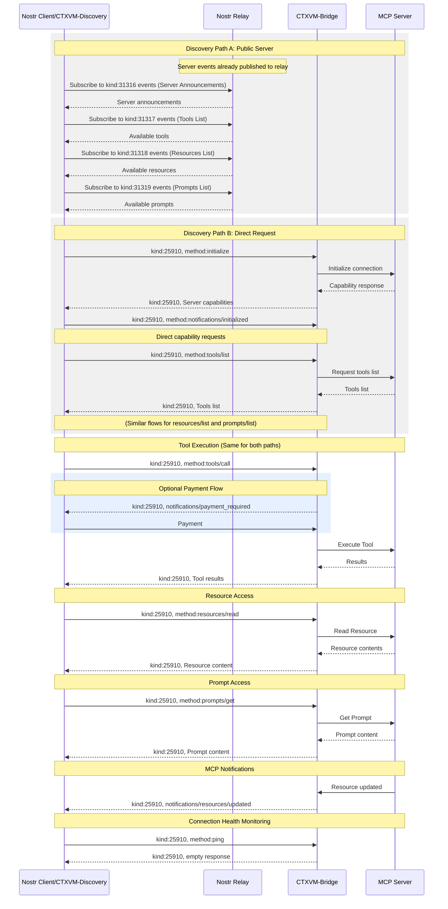

# CTXVM Protocol Specification

**MCP Version:** `mcp:2025-03-26`
**Status:** Draft

## Abstract

The Context Vending Machine (CTXVM) specification defines how Nostr and Context Vending Machines can be used to expose Model Context Protocol (MCP) server capabilities, enabling standardized usage of these resources through a decentralized, cryptographically secure messaging system.

## Table of Contents

- [Introduction](#introduction)
  - [Public Key Cryptography](#public-key-cryptography)
- [Protocol Overview](#protocol-overview)
  - [Main Actors](#main-actors)
- [Protocol Consistency](#protocol-consistency)
  - [Message Structure Consistency](#message-structure-consistency)
- [Event Kinds](#event-kinds)
- [Server Discovery](#server-discovery)
  - [Discovery via Server Announcements (Public Servers)](#discovery-via-server-announcements-public-servers)
    - [Server Announcement Event](#server-announcement-event)
    - [Tools List Event](#tools-list-event)
    - [Resources List Event](#resources-list-event)
    - [Prompts List Event](#prompts-list-event)
  - [Capability Pricing](#capability-pricing)
    - [Pricing Tag Format](#pricing-tag-format)
    - [Example](#example)
    - [Payment Handling](#payment-handling)
  - [Direct Discovery (Private Servers)](#direct-discovery-private-servers)
    - [Client Initialization Request](#client-initialization-request)
    - [Server Initialization Response](#server-initialization-response)
    - [Client Initialized Notification](#client-initialized-notification)
- [Capability Operations](#capability-operations)
  - [List Operations](#list-operations)
    - [List Request Template](#list-request-template)
    - [List Response Template](#list-response-template)
  - [Capability-Specific Item Examples](#capability-specific-item-examples)
    - [Call Tool Request](#call-tool-request)
    - [Call Tool Response](#call-tool-response)
- [Encryption](#encryption)
  - [Overview](#overview-1)
  - [Encryption Support Discovery](#encryption-support-discovery)
  - [Message Encryption Flow](#message-encryption-flow)
    - [1. Content Preparation](#1-content-preparation)
    - [2. Seal Creation (NIP-17)](#2-seal-creation-nip-17)
    - [3. Gift Wrapping (NIP-59)](#3-gift-wrapping-nip-59)
  - [Encrypted Event Structure](#encrypted-event-structure)
    - [Original CTXVM Request](#original-CTXVM-request)
    - [Encrypted CTXVM Request](#encrypted-CTXVM-request)
    - [Encrypted Response Structure](#encrypted-response-structure)
- [Notifications](#notifications)
  - [Notification Template](#notification-template)
  - [Payment Required Notification](#payment-required-notification)
- [Error Handling](#error-handling)
  - [Error Types](#error-types)
  - [Error Response Template](#error-response-template)
- [Implementation Requirements](#implementation-requirements)
- [Complete Protocol Flow](#complete-protocol-flow)
- [Subscription Management](#subscription-management)

## Introduction

The [Model Context Protocol](https://modelcontextprotocol.io/introduction) provides a protocol specification to create servers exposing capabilities and clients consuming them. Meanwhile, the Nostr network and Context Vending Machines offer a decentralized way to announce and consume computational services. This specification defines how to bridge these protocols, allowing MCP servers to advertise and provide their services through the Nostr network.

This specification aims to:

1. Enable discovery of MCP servers and their capabilities through the Nostr network
2. Provide a consistent experience for clients accessing capabilities, and servers exposing their capabilities
3. Maintain compatibility with both protocols while preserving their security models

By integrating these protocols, CTXVM combines the standardized capability framework of MCP with the decentralized, cryptographically secure messaging of Nostr. This integration enables several key advantages:

- **Discoverability**: MCP servers can be discovered through the Nostr network without centralized registries
- **Verifiability**: All messages are cryptographically signed using Nostr's public keys
- **Decentralization**: No single point of failure for service discovery or communication
- **Protocol Interoperability**: Both MCP and CTXVMs utilize JSON-RPC patterns, enabling seamless communication between the protocols

The integration preserves the security model of both protocols while enabling new patterns of interaction.

### Public Key Cryptography

CTXVM leverages Nostr's public key cryptography to ensure message authenticity and integrity:

1. **Message Verification**: Every message is cryptographically signed by the sender's private key and can be verified using their public key, ensuring that:
   - Server announcements come from legitimate providers
   - Client requests are from authorized users
   - Responses are from the expected servers

2. **Identity Management**: Public keys serve as persistent identifiers for all actors in the system:
   - Providers can maintain consistent identities across relays
   - Clients can be uniquely identified for authorization purposes
   - Server identifiers are associated with provider public keys

The cryptographic properties enable secure authorization flows for paid services and private capabilities without requiring centralized authentication services.

## Protocol Overview

CTXVM bridges MCP and Nostr protocols through a consistent message structure and well-defined workflow.

### Message Structure

The protocol uses these key design principles for message handling:

1. **Content Field Structure**: The `content` field of Nostr events contains stringified MCP messages that omit only the `jsonrpc` version and `id` fields. All other MCP message structures, are preserved exactly as defined in the MCP specification:
   - For requests: Contain `method` and `params` fields
   - For responses: Contain the complete MCP response structure with the `result` field properly nested
   - For notifications: Contain `method` and optional `params` fields

2. **Nostr Metadata in Tags**: All Nostr-specific metadata uses event tags:
   - `d`: Unique server identifier, defined by the provider
   - `s`: Server identifier for targeting specific servers, should be the `d` tag of the server being targeted
   - `p`: Public key for addressing providers or clients
   - `e`: Event id, references for correlating requests and responses
   - `cap`: Capability tag for tools, resources, and prompts to provide pricing metadata

3. **Unified Event Kind**: CTXVM uses a single event kind for all communication with specific storage characteristics:
   - `25910`: All CTXVM messages (ephemeral events)
   - `31316`-`31319`: Server announcements and capability listings (addressable events)
   - `1059`: Encrypted Messages (NIP-59 Gift Wrap)

   These event kinds follow Nostr's conventions in [NIP-01](https://github.com/nostr-protocol/nips/blob/master/01.md#kinds):
   - For kind n such that 20000 <= n < 30000, events are ephemeral, which means they are not expected to be stored by relays for a long period, but rather just transmitted.
   - For kind n such that 30000 <= n < 40000, events are addressable by their kind, pubkey and d tag value -- which means that, for each combination of kind, pubkey and the d tag value, only the latest event MUST be stored by relays, older versions MAY be discarded.

### Main Actors

There are four main actors in this workflow:

- **Providers**: Entities running MCP server(s), operating behind a Nostr public key
- **Servers**: MCP servers exposing capabilities, operated by a provider
- **Relays**: Core part of Nostr protocol that allows communication between clients and servers
- **Clients**: MCP or Nostr clients that discover and consume capabilities from servers

## Protocol Consistency

### Message Structure Consistency

All CTXVM messages use the same fundamental structure while allowing for semantic differentiation through tags and content interpretation

## Event Kinds

This specification defines these event kinds:

| Kind  | Description                           |
| ----- | ------------------------------------- |
| 25910 | CTXVM Messages                        |
| 1059  | Encrypted Messages (NIP-59 Gift Wrap) |
| 31316 | Server Announcement                   |
| 31317 | Tools List                            |
| 31318 | Resources List                        |
| 31319 | Prompts List                          |

**Note on Encryption**: When encryption is enabled, kind 25910 events are wrapped using NIP-17/NIP-59 encryption and published as kind 1059 events. Addressable events (kinds 31316-31319) remain unencrypted for discoverability.

## Server Discovery

CTXVM provides two methods of server discovery, the main differences between these two methods being the visibility of the servers and the way they are advertised. Public servers can advertise themselves and their capabilities to improve discoverability when providing a "public" or accessible service. Private servers may not advertise themselves and their capabilities, but they can be discovered by clients that know the provider's public key or server identifier.

### Discovery via Server Announcements (Public Servers)

// TODO: Improve this section now that the initialization round is managed by clients. This public announcements could allow to just get the connection parameters (public key and serverId) out of a nip19 identifier, like `naddr...`

Providers announce their servers and capabilities by publishing events with kinds 31316 (server), 31317 (tools/list), 31318 (resources/list), and 31319 (prompts/list).

**Note:** The `content` field of CTXVM events contains stringified MCP messages. The examples below present the `content` as a JSON object for readability; it must be stringified before inclusion in a Nostr event.

#### Server Announcement Event

```json
{
  "kind": 31316,
  "pubkey": "<provider-pubkey>",
  "content": {
    "protocolVersion": "2025-07-02",
    "capabilities": {
      "prompts": {
        "listChanged": true
      },
      "resources": {
        "subscribe": true,
        "listChanged": true
      },
      "tools": {
        "listChanged": true
      }
    },
    "serverInfo": {
      "name": "ExampleServer",
      "version": "1.0.0"
    },
    "instructions": "Optional instructions for the client"
  },
  "tags": [
    ["d", "<server-identifier>"], // Required: Unique identifier for the server
    ["name", "Example Server"], // Optional: Human-readable server name
    ["about", "Server description"], // Optional: Server description
    ["picture", "https://example.com/server.png"], // Optional: Server icon/avatar URL
    ["website", "https://example.com"], // Optional: Server website
    ["support_encryption"] // Optional: Presence indicates server supports encrypted messages
  ]
}
```

#### Tools List Event

```json
{
  "kind": 31317,
  "pubkey": "<provider-pubkey>",
  "content": {
    "tools": [
      {
        "name": "get_weather",
        "description": "Get current weather information for a location",
        "inputSchema": {
          "type": "object",
          "properties": {
            "location": {
              "type": "string",
              "description": "City name or zip code"
            }
          },
          "required": ["location"]
        }
      }
    ]
  },
  "tags": [
    ["d", "<unique-identifier>"], // Required: Unique identifier for the tools list
    ["s", "<server-identifier>"] // Required: Reference to the server it belongs to
  ]
}
```

The rest of the capabilities (resources, prompts, completions, ping, etc) follow the same pattern as the above examples.

### Direct Discovery (Private Servers)

For servers that are not publicly announced, clients MUST use the MCP initialization process. The flow involves a client initialization request, a server initialization response, and a client initialized notification:

#### Client Initialization Request

```json
{
  "kind": 25910,
  "content": {
    "jsonrpc": "2.0",
    "id": 0,
    "method": "initialize",
    "params": {
      "protocolVersion": "2025-07-02",
      "capabilities": {
        "roots": {
          "listChanged": true
        },
        "sampling": {}
      },
      "clientInfo": {
        "name": "ExampleClient",
        "version": "1.0.0"
      }
    }
  },
  "tags": [
    ["p", "<provider-pubkey>"],
    ["s", "<server-identifier>"], // Optional field, if omitted all the servers from the providers SHOULD respond
    ["method", "initialize"]
  ]
}
```

- Tags:
  - `p`: Provider public key, to target all the servers from a provider
  - `s`: Server identifier, optional for target a server
  - `method`: Method name

#### Server Initialization Response

```json
{
  "kind": 25910,
  "pubkey": "<provider-pubkey>",
  "content": {
    "jsonrpc": "2.0",
    "id": 0,
    "result": {
      "protocolVersion": "2025-07-02",
      "capabilities": {
        "logging": {},
        "prompts": {
          "listChanged": true
        },
        "resources": {
          "subscribe": true,
          "listChanged": true
        },
        "tools": {
          "listChanged": true
        }
      },
      "serverInfo": {
        "name": "ExampleServer",
        "version": "1.0.0"
      },
      "instructions": "Optional instructions for the client"
    }
  },
  "tags": [
    ["e", "<client-init-request-id>"],
    ["d", "<server-identifier>"],
    ["support_encryption"] // Optional: Presence indicates server supports encrypted messages
  ]
}
```

When a server responds to an initialization request, it includes a `d` tag in the response that serves as the server identifier. Clients should use this identifier in the `s` tag of subsequent requests to target this specific server. This approach allows clients to discover and interact with servers without prior knowledge of their identifiers.

- Tags:
  - `d`: Server identifier, uniquely identifies this server for future requests
  - `e`: Reference to the client's initialization request event

#### Client Initialized Notification

After receiving the server initialization response, the client MUST send an initialized notification to indicate it is ready to begin normal operations:

```json
{
  "kind": 25910,
  "pubkey": "<client-pubkey>",
  "content": {
    "jsonrpc": "2.0",
    "method": "notifications/initialized"
  },
  "tags": [
    ["p", "<provider-pubkey>"], // Required: Target provider public key
    ["s", "<server-identifier>"] // Required: Server identifier
  ]
}
```

This notification completes the initialization process and signals to the server that the client has processed the server's capabilities and is ready to begin normal operations.

## Capability Operations

After discover a server publicly, or initialization, clients can interact with server capabilities, even if the server is public, and its exposing capabilities publicly, you can still requesting list tools, resources, prompts, in order to use pagination if necessary

### List Operations

All list operations follow the same structure described by MCP, with the specific capability type indicated in the method name.

- Tags:
  - `p`: Provider public key, to target all the servers from a provider
  - `s`: Server identifier, optional for target a server
  - `method`: Method name

#### List Request Template

```json
{
  "kind": 25910,
  "pubkey": "<client-pubkey>",
  "id": "<request-event-id>",
  "content": {
    "jsonrpc": "2.0",
    "id": 1,
    "method": "<capability>/list", // tools/list, resources/list, or prompts/list
    "params": {
      "cursor": "optional-cursor-value"
    }
  },
  "tags": [
    ["p", "<provider-pubkey>"], // Required: Provider's public key
    ["s", "<server-identifier>"] // Optional: Server identifier
  ]
}
```

#### List Response Template

```json
{
  "kind": 25910,
  "pubkey": "<provider-pubkey>",
  "content": {
    "jsonrpc": "2.0",
    "id": 1,
    "result": {
      "<items>": [
        // "tools", "resources", or "prompts" based on capability
        // Capability-specific item objects
      ],
      "nextCursor": "next-page-cursor"
    }
  },
  "tags": [
    ["e", "<request-event-id>"] // Required: Reference to the request event
  ]
}
```

### Capability-Specific Item Examples

#### Call Tool Request

```json
{
  "kind": 25910,
  "id": "<request-event-id>",
  "pubkey": "<client-pubkey>",
  "content": {
    "jsonrpc": "2.0",
    "id": 2,
    "method": "tools/call",
    "params": {
      "name": "get_weather",
      "arguments": {
        "location": "New York"
      }
    }
  },
  "tags": [
    ["p", "<provider-pubkey>"],
    ["s", "<server-identifier>"]
  ]
}
```

#### Call Tool Response

```json
{
  "kind": 25910,
  "pubkey": "<provider-pubkey>",
  "content": {
    "jsonrpc": "2.0",
    "id": 2,
    "result": {
      "content": [
        {
          "type": "text",
          "text": "Current weather in New York:\nTemperature: 72°F\nConditions: Partly cloudy"
        }
      ],
      "isError": false
    }
  },
  "tags": [["e", "<request-event-id>"]]
}
```

For the rest of capabilities (resources, prompts, completions, ping, etc) the `content` field follows the same pattern as other MCP messages, containing a stringified simplified JSON-RPC object that adheres to the MCP specification.

### Capability Pricing

CTXVM supports pricing for capabilities through the use of `cap` tags in capability announcement or list events.

#### Pricing Tag Format

Pricing information is conveyed using the `cap` tag with the following format:

```json
["cap", "<capability-identifier>", "<price>", "<currency-unit>"]
```

Where:

- `<capability-identifier>` is the name of the tool, prompt, or resource URI
- `<price>` is a string representing the numerical amount (e.g., "100")
- `<currency-unit>` is the currency symbol (e.g., "sats", "usd")

#### Example

A tool list event with pricing for the `get_weather` tool:

From public server announcements:

```json
{
  "kind": 31317,
  "content": {
    "tools": [
      {
        "name": "get_weather",
        "description": "Get current weather information"
        // ... other tool properties
      }
    ]
  },
  "tags": [
    ["d", "server-123/tools/list"],
    ["s", "server-123"],
    ["cap", "get_weather", "100", "sats"]
  ]
}
```

From capability list events:

```json
{
  "kind": 25910,
  "pubkey": "<provider-pubkey>",
  "content": {
    "result": {
      "tools": [
        {
          "name": "get_weather",
          "description": "Get current weather information"
          // ... other tool properties
        }
      ],
      "nextCursor": "next-page-cursor"
    }
  },
  "tags": [
    ["e", "<request-event-id>"], // Required: Reference to the request event
    ["cap", "get_weather", "100", "sats"] // Optional: Pricing metadata
  ]
}
```

This indicates that using the `get_weather` tool costs 100 satoshis. Clients can use this information to display pricing to users.

#### Payment Handling

When a capability has pricing information, clients and servers should handle payments. The lifecycle of request with payment follows these steps:

1. **Request**: Client sends a capability request to the server
2. **Invoice Generation**: Server sends a `notifications/payment_required` notification with a payment request (e.g., Lightning Network invoice, Cashu PaymentRequest, Payment gateway URL, etc.)
3. **Payment Verification**: Client pays
4. **Capability Access**: Once payment is verified, the server processes the capability request, and responds with the result

Payment verification is handled by the server and can be implemented using Lightning Network zaps (NIP-57) or other payment methods.

## Encryption

### Overview

CTXVM supports optional end-to-end encryption for enhanced privacy and security using the Nostr protocol's encryption standards. This feature leverages NIP-17 (Private Direct Messages) for secure message encryption and NIP-59 (Gift Wrap) for metadata protection, ensuring that:

1. **Message Content Privacy**: All CTXVM message content is encrypted using NIP-44 encryption
2. **Metadata Protection**: Gift wrapping hides participant identities, timestamps, and message patterns
3. **Selective Encryption**: Clients and servers can negotiate encryption on a per-session basis

Encryption in CTXVM maintains full compatibility with the standard protocol while adding an additional privacy layer. When encryption is enabled, all kind 25910 events are encrypted using the NIP-17/NIP-59 pattern, while addressable events (server announcements and capability lists) remain unencrypted for discoverability.

### Encryption Support Discovery

Encryption support is advertised through the `support_encryption` tag in server announcement events or direct initialization responses. The presence of this tag indicates that the server supports encryption; its absence signifies that the server does not support encryption:

```json
{
  "pubkey": "<provider-pubkey>",
  "content": {
    /* server details */
  },
  "tags": [
    ["support_encryption"] // Presence alone indicates encryption support
    // ... other tags
  ]
}
```

Clients can discover encryption support by:

1. **Public Server Discovery**: Check for the presence of the `support_encryption` tag in server announcements (kind 31316)
2. **Direct Discovery**: Check for the presence of the `support_encryption` tag in initialization responses

### Message Encryption Flow

When encryption is enabled, CTXVM messages follow a simplified NIP-17 pattern with no 'rumor' with NIP-59 gift wrapping:

#### 1. Request Preparation

The request is prepared as usual:

```json
{
  "kind": 25910,
  "id": "<request-event-id>",
  "pubkey": "<client-pubkey>",
  "content": {
    "jsonrpc": "2.0",
    "id": 2,
    "method": "tools/call",
    "params": {
      "name": "get_weather",
      "arguments": {
        "location": "New York"
      }
    }
  },
  "tags": [
    ["p", "<provider-pubkey>"],
    ["s", "<server-identifier>"]
  ]
}
```

#### 2. Gift Wrapping (NIP-59)

The request is then converted in json string, and gift-wrapped (kind 1059) with a random key, following nip-44 encryption:

```json
{
  "id": "<gift-wrap-hash>",
  "pubkey": "<random-pubkey>",
  "created_at": "<randomized-timestamp>",
  "kind": 1059,
  "tags": [["p", "<server-pubkey>"]],
  "content": "<nip44-encrypted-request>",
  "sig": "<random-key-signature>"
}
```

#### Encrypted Response Structure

Server responses follow the same pattern

Requests are prepared as usual:

```json
{
  "kind": 25910,
  "pubkey": "<provider-pubkey>",
  "content": {
    "jsonrpc": "2.0",
    "id": 2,
    "result": {
      "content": [
        {
          "type": "text",
          "text": "Current weather in New York:\nTemperature: 72°F\nConditions: Partly cloudy"
        }
      ],
      "isError": false
    }
  },
  "tags": [["e", "<request-event-id>"]]
}
```

The response is then converted in json string, and gift-wrapped (kind 1059) with a random key, following nip-44 encryption:

```json
{
  "kind": 1059,
  "pubkey": "<random-ephemeral-pubkey>",
  "created_at": "<randomized-timestamp>",
  "content": "<nip44-encrypted-containing-CTXVM-response>",
  "tags": [["p", "<client-pubkey>"]],
  "sig": "<ephemeral-key-signature>"
}
```

The decrypted inner content contains the standard CTXVM response format.

**Note:** The response should use the id of original request as `e` tag, not the gift-wrapped event `id`.

## Notifications

All notifications in CTXVM follow the standard MCP notification format and conventions, using the unified kind 25910 event type. This includes notifications for payment requests, progress updates, and all other server-to-client or client-to-server communications.

Notifications are constructed according to the MCP notification template. The direction is determined by the `p` tag: client-to-server notifications are signed by the client's pubkey and use the server's pubkey as the `p` tag; server-to-client notifications are signed by the server's provider pubkey and use the client's pubkey as the `p` tag.

### Notification Event Example

```json
{
  "kind": 25910,
  "pubkey": "<sender-pubkey>",
  "content": {
    "method": "notifications/<type>",
    "params": {
      /* Optional parameters based on notification type */
    }
  },
  "tags": [
    ["p", "<recipient-pubkey>"] // Required: Target public key (recipient)
  ]
}
```

### Payment Required Notification Example

```json
{
  "kind": 25910,
  "pubkey": "<provider-pubkey>",
  "content": {
    "method": "notifications/payment_required",
    "params": {
      "amount": 1000,
      "currency": "sats",
      "invoice": "lnbc...",
      "description": "Payment for tool execution"
    }
  },
  "tags": [
    ["p", "<client-pubkey>"],
    ["e", "<request-event-id>"]
  ]
}
```

For long-running jobs, servers should send progress notifications frequently to indicate the job is still processing and to prevent client timeout.

## Error Handling

MCP handles two types of errors: protocol errors and execution errors.

### Error Types

| Error Type      | Description                                                        | Format                                                   |
| --------------- | ------------------------------------------------------------------ | -------------------------------------------------------- |
| Protocol Error  | JSON-RPC protocol-level errors (invalid method, params, etc.)      | Error object in content with error code and message      |
| Execution Error | Errors during tool execution (API failures, business logic errors) | Object with `isError: true` and error details in content |

### Error Response Template

```json
{
  "kind": 25910,
  "pubkey": "<provider-pubkey>",
  "content": {
    // Either an error object (protocol error):
    "error": {
      "code": -32602, // Standard JSON-RPC error code
      "message": "Error description"
    },
    // Or a result with isError flag (tool execution error):
    "result": {
      "content": [
        {
          "type": "text",
          "text": "Error details"
        }
      ],
      "isError": true
    }
  },
  "tags": [
    ["e", "<request-event-id>"] // Required: Reference to the request event
  ]
}
```

**Common Error Codes:**

- `-32700`: Parse error
- `-32600`: Invalid request
- `-32601`: Method not found
- `-32602`: Invalid params
- `-32603`: Internal error
- `-32002`: Resource not found

## Complete Protocol Flow



## Subscription Management

Unlike direct MCP connections, Nostr's pub/sub model requires special handling for long-lived subscriptions:

1. **Connection Persistence**: Clients and servers SHOULD maintain relay connections to receive notifications for subscribed resources.

2. **Progress Notifications**: For long-running operations, servers SHOULD send progress notifications as defined in the protocol to:
   - Indicate processing status
   - Prevent client timeouts
   - Maintain subscription activity

3. **Subscription Termination**: Subscriptions can be terminated in several ways:
   - When the client receives a successful result
   - When an error occurs during processing
   - When the client explicitly sends a cancellation request
   - When the connection times out due to network issues

4. **Message Correlation**: All responses and notifications MUST include appropriate `e`, and `p` tags to correlate with the original request, ensuring proper message routing in the decentralized environment.
