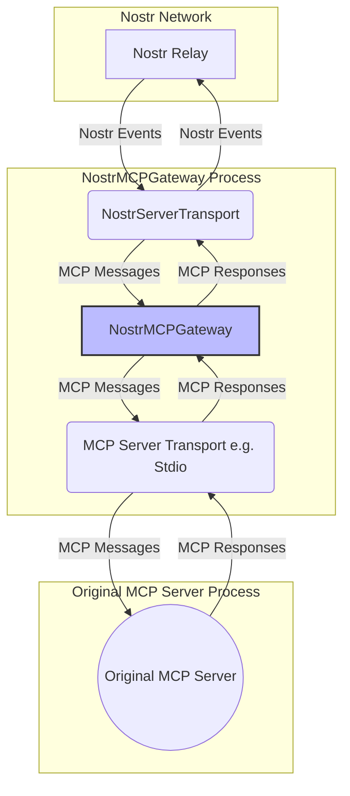
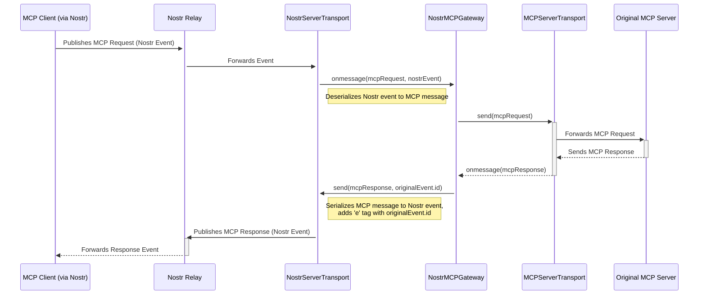

# NostrMCPGateway Low-Level Design

## 1. Introduction

This document provides a detailed low-level design for the `NostrMCPGateway` component. It builds upon the high-level architecture defined in [`docs/ctxvm-nostr-hldd-architecture.md`](docs/ctxvm-nostr-hldd-architecture.md) and provides a concrete implementation plan.

The primary goal of the `NostrMCPGateway` is to act as a bridge, enabling a standard MCP Server (e.g., a local tool provider) to expose its capabilities over the Nostr network. It will listen for MCP requests encapsulated in Nostr events, forward them to the local MCP server, and publish the server's responses back to the Nostr network.

The design philosophy is to keep the implementation simple and clean by transparently wiring two transports together: one for Nostr communication and one for the local MCP server.

## 2. Overall Architecture and Core Components

The `NostrMCPGateway` will be structured around a central coordinating class that manages two transport instances. This approach is inspired by the existing [`NostrMCPProxy`](src/proxy/index.ts) and promotes code reuse and separation of concerns.

The core components are as follows:

- **`NostrMCPGateway` Class**: The main orchestrator responsible for initializing and connecting the two transports. It will be the entry point for starting the gateway service.

- **`NostrServerTransport`**: A new transport class responsible for server-side Nostr communications. It will inherit from [`BaseNostrTransport`](src/core/base-nostr-transport.ts) and handle the following:
  - Subscribing to Nostr relays to listen for incoming requests targeting the gateway's public key.
  - Deserializing Nostr events into MCP messages.
  - Serializing MCP messages (responses) into Nostr events.
  - Signing and publishing events to Nostr relays.

- **MCP Server Transport**: A standard MCP transport implementation, such as `StdioServerTransport`, which will be used to communicate with the `Original MCP Server`. This transport will be provided to the gateway at initialization.

- **`NostrSigner`**: An implementation of the `NostrSigner` interface (e.g., `PrivateKeySigner`) used by the `NostrServerTransport` to sign outgoing Nostr events.

- **`RelayHandler`**: An implementation of the `RelayHandler` interface (e.g., `SimpleRelayPool`) used by the `NostrServerTransport` to manage connections to Nostr relays.



## 3. Key Classes and Interfaces

This section details the primary classes and interfaces that will form the `NostrMCPGateway`.

### 3.1. `NostrMCPGateway`

This is the central class that orchestrates the gateway's operation.

**File:** `src/gateway/index.ts`

**Responsibilities:**

- Initialize the `NostrServerTransport` and the provided `MCPServerTransport`.
- Wire the two transports together, passing messages between them.
- Manage the lifecycle of the transports (`start`, `stop`).
- Handle ID correlation between Nostr events and MCP messages to ensure responses are correctly routed back to the original requester.

**Interface (preliminary):**

```typescript
interface NostrMCPGatewayOptions {
  mcpServerTransport: Transport; // e.g., StdioServerTransport
  nostrTransportOptions: NostrServerTransportOptions;
}

class NostrMCPGateway {
  constructor(options: NostrMCPGatewayOptions);
  async start(): Promise<void>;
  async stop(): Promise<void>;
  private handleMessageFromNostr(
    message: JSONRPCMessage,
    nostrEvent: NostrEvent,
  ): Promise<void>;
  private handleMessageFromServer(message: JSONRPCMessage): Promise<void>;
}
```

### 3.2. `NostrServerTransport`

This class handles all server-side Nostr communication. It will be a new implementation that adapts the `BaseNostrTransport` for server-specific logic.

**File:** `src/transport/server.ts` (new file)

**Responsibilities:**

- Inherit from [`BaseNostrTransport`](src/core/base-nostr-transport.ts) to reuse common Nostr logic.
- Implement the MCP `Transport` interface.
- On `start`, connect to relays and subscribe to events targeting the gateway's public key (`p` tag).
- On receiving a valid Nostr event, deserialize it into an MCP message and pass it to the `NostrMCPGateway` via the `onmessage` callback.
- When `send` is called (with a response from the MCP server), serialize the MCP message into a Nostr event, sign it, and publish it to the relays. The response event must include an `e` tag referencing the original request event's ID.

**Interface (preliminary):**

```typescript
interface NostrServerTransportOptions extends BaseNostrTransportOptions {
  // Any gateway-specific options can be added here
}

class NostrServerTransport extends BaseNostrTransport implements Transport {
  onmessage?: (message: JSONRPCMessage, originalEvent: NostrEvent) => void;
  onerror?: (error: Error) => void;
  onclose?: () => void;

  constructor(options: NostrServerTransportOptions);

  async start(): Promise<void>;
  async close(): Promise<void>;
  send(message: JSONRPCMessage, originalRequestEventId?: string): Promise<void>;
}
```

### 3.3. MCP Server Transport (`Transport`)

This is not a new component but a crucial part of the gateway's configuration. It will be an existing implementation of the `Transport` interface from the `@modelcontextprotocol/sdk`. A prime example is `StdioServerTransport` for connecting to a local MCP server process via standard I/O.

**Responsibilities:**

- Provide a standard communication channel to the `Original MCP Server`.
- The `NostrMCPGateway` will receive this transport instance during its initialization.

## 4. Communication Flow

The following sequence diagram illustrates the end-to-end communication flow for a single request-response cycle, from the remote MCP Client to the Original MCP Server and back.



## 5. Event Handling and ID Correlation

Properly correlating incoming Nostr requests with outgoing MCP responses is critical for the gateway's function. The gateway must ensure that a response from the `Original MCP Server` is published back to Nostr in a way that the original client can associate it with its request.

This is achieved by using the Nostr event `id` as the key for correlation. The `NostrMCPProxy` on the client side initiates a request and expects a response event that includes an `e` tag referencing the original request's event `id`.

The `NostrMCPGateway` is responsible for storing this relationship temporarily.

### 5.1. Correlation Logic

1.  **Request Received**: When `NostrServerTransport` receives a Nostr event, it deserializes it and passes both the resulting `JSONRPCRequest` and the original `NostrEvent` to the `NostrMCPGateway`.

2.  **Store Mapping**: The `NostrMCPGateway` maintains an in-memory `Map` to store the correlation between the MCP request ID and the Nostr event ID.

    ```typescript
    // Inside NostrMCPGateway
    private pendingRequests = new Map<string | number, string>(); // mcpRequestId -> nostrEventId
    ```

    Upon receiving a request, it will store the mapping:

    ```typescript
    this.pendingRequests.set(mcpRequest.id, nostrEvent.id);
    ```

3.  **Forward to Server**: The `mcpRequest` is then forwarded to the `Original MCP Server` via the `MCPServerTransport`.

4.  **Response Received**: When the `NostrMCPGateway` receives a `JSONRPCResponse` from the `MCPServerTransport`, it uses the response's `id` to look up the original Nostr event ID from the `pendingRequests` map.

    ```typescript
    const originalNostrEventId = this.pendingRequests.get(mcpResponse.id);
    ```

5.  **Publish Response**: The gateway passes the `mcpResponse` and the `originalNostrEventId` to the `NostrServerTransport`'s `send` method. The transport creates a new Nostr event, ensuring the response is tagged correctly:

    ```typescript
    // Inside NostrServerTransport, when creating the response event
    const tags = [
      ['e', originalNostrEventId],
      ['p', originalRequesterPubkey],
    ];
    ```

6.  **Cleanup**: After the lookup, the entry in the `pendingRequests` map is deleted to prevent memory leaks.
    ```typescript
    this.pendingRequests.delete(mcpResponse.id);
    ```

This mechanism ensures that every response is correctly linked back to its originating request in the stateless environment of the Nostr network.
